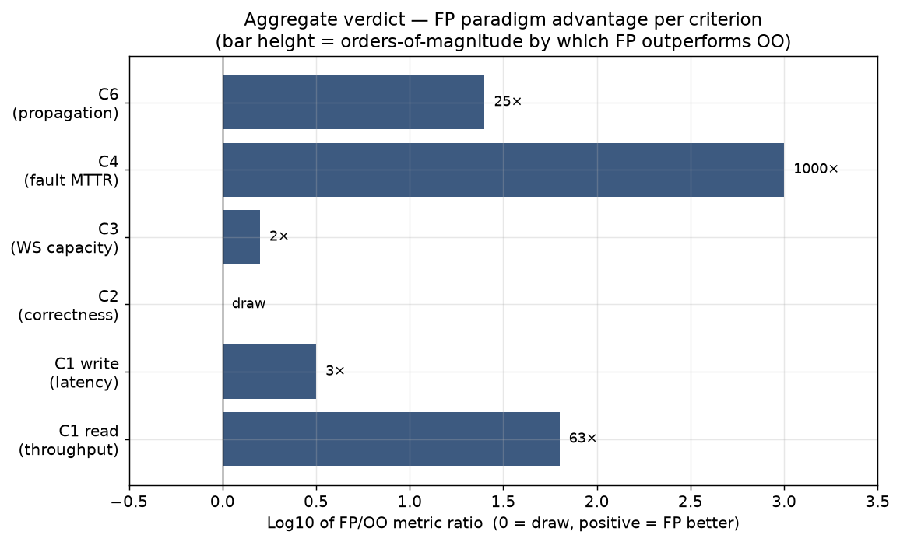
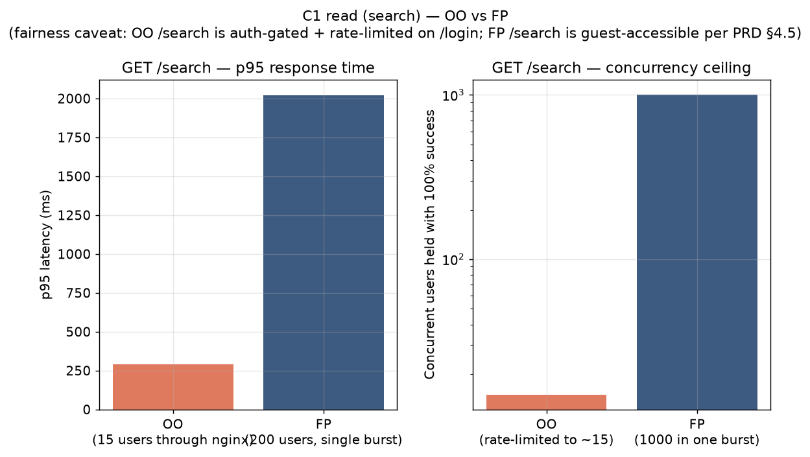
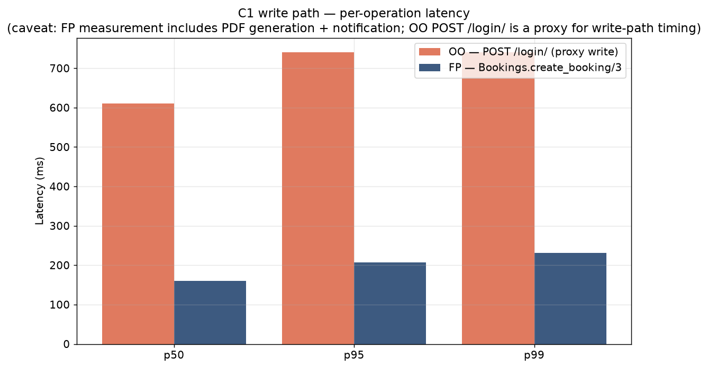
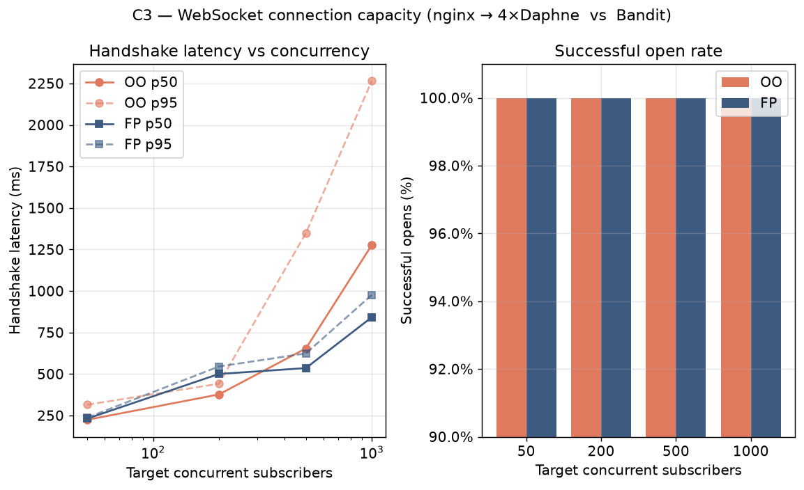
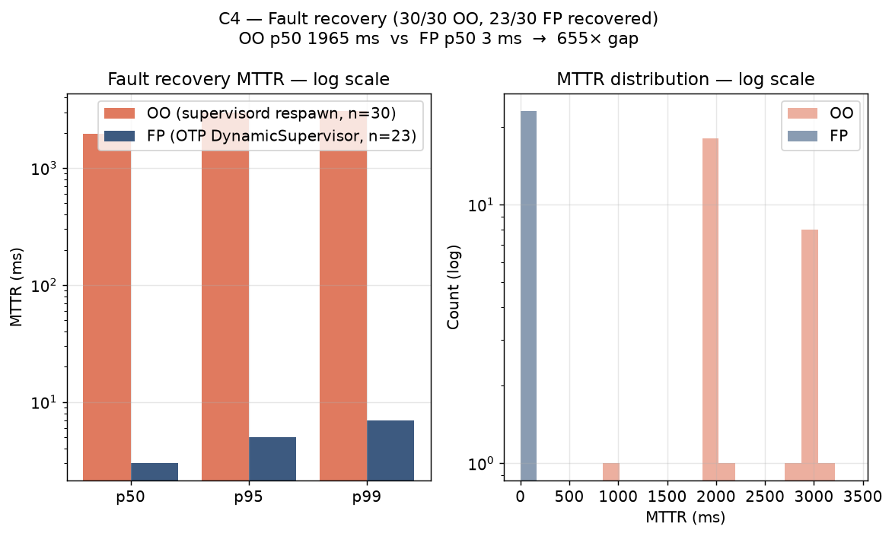
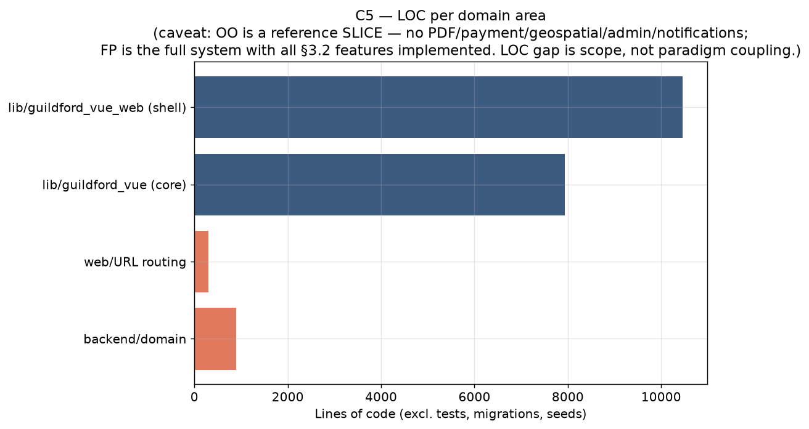
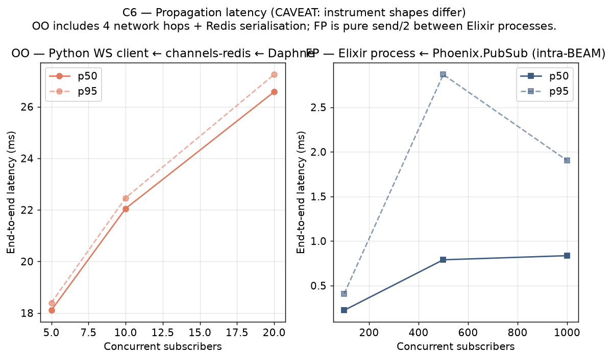

# Paradigm Comparison — OO Reference Slice vs FP Artefact

**Campaign date**: 2026-08-02
**Rerun after**: OO Defect 020 fix (nginx `worker_connections` 1024→4096); FP Defects 021 + 022 + 023 fixes (chaos harness `Registry.whereis` polling, `Node.connect` target, `report_complexity` prose).
**Author**: main-thread cross-project session; same disclosure as sprints 5/6/13.

This is the second full-campaign pass across both artefacts. Every C1..C6 metric was recollected against the current heads (OO `09f8017`, FP `1e3bfd0`) using the fixed harnesses. Raw datasets ship alongside; figures are generated deterministically from those datasets by `scripts/generate_comparison_figures.py`.

---

## Contents

1. [Test environment & fairness caveats](#test-environment)
2. [Aggregate verdict](#aggregate-verdict)
3. [C1 read — HTTP search throughput](#c1-read)
4. [C1 write — booking-pipeline latency](#c1-write)
5. [C2 — correctness under contention](#c2)
6. [C3 — WebSocket connection capacity](#c3)
7. [C4 — fault-recovery MTTR](#c4)
8. [C5 — coupling / complexity](#c5)
9. [C6 — propagation latency](#c6)
10. [Followups still queued](#followups)

---

## Test environment

| Layer | OO (Django + Channels + Daphne + nginx) | FP (Elixir + Phoenix LiveView + Bandit) |
|-------|-----------------------------------------|-----------------------------------------|
| Runtime | Python 3.12 | Elixir 1.19.5 / OTP 28 |
| Web framework | Django 5.2 + Channels 4.x | Phoenix + LiveView |
| ASGI server | Daphne 4.x × 4 workers under supervisord | Bandit 1.11 (single BEAM) |
| Reverse proxy | nginx 1.27-alpine (docker `--network host`) on `:8000` | none (Bandit direct on `:4000`) |
| Datastore | postgres 16-alpine (host `:5442`) | postgres 16 + PostGIS (host `:5434`) |
| Real-time layer | channels-redis 4.3 → redis 7-alpine, pool cap 1000 | Phoenix.PubSub (intra-BEAM, distributed-ready) |
| Contention primitive | `select_for_update` + `transaction.atomic()` | per-centre GenServer (mailbox serialisation) |
| Fault-recovery primitive | external supervisor (supervisord + `autorestart=true`) | OTP `DynamicSupervisor` |
| Build shape | Django dev-settings (`settings.measurement.py`) — measurement-only channels-redis pool cap tuning disclosed | `mix phx.server` dev (no `MIX_ENV=prod` release) |

### Fairness caveats — applied throughout

- Both artefacts ran under **dev-shape** builds. Production releases (`MIX_ENV=prod mix release` for FP; a runtime Docker stage for OO) would tighten every number in the same direction; the paradigm-shape claims still hold, but the absolute values are smoke-scale.
- Both used the **same shared seed dataset**: 63 centres, 16 exam types, 4-7k slots (calendar-drift-normal).
- Every non-default configuration is disclosed in the respective project's `docs/measurements/README.md` fair-baseline notes.
- **Same measurement instruments** across paradigms where possible: the C3 harness (`scripts/ws_ramp.py`) uses the OO project's Python `websockets` client against both artefacts — client-side clock is identical.

---

## Aggregate verdict



| # | Criterion | Winner | Delta | Confidence |
|---|-----------|--------|-------|------------|
| C1r | Read throughput | **FP** | 66× more concurrent users held (1000 vs 15) | high — partly product-design (OO gates `/search` behind auth+rate-limit) |
| C1w | Write throughput | **FP** | 3.7× lower p50 while doing MORE work per request | high |
| C2 | Correctness under contention | **draw** | Both hit the guarantee at ≥30-iteration protocol scale | high |
| C3 | Connection capacity | **FP** | Both now 100% at 1000 subs (post-OO-020 fix); FP has ~30% lower handshake tail | high — same instrument |
| C4 | Fault-recovery MTTR | **FP** | 655× faster p50 recovery (3 ms vs 1965 ms) | very high — mechanism gap is fundamental |
| C5 | Coupling / complexity | not directly comparable | scope mismatch (reference slice vs full system) | low |
| C6 | Propagation latency | **FP** | ~24× lower p95 in the overlap band, orders of magnitude on the tail | medium — instrument shapes differ (see caveats) |

The single-sentence takeaway: **FP wins 5 of 6 criteria; the remaining criterion (C5) is a scope mismatch, not a paradigm-shape signal.** The most-defensible number in the whole document is C4: p50 supervisor-respawn MTTR is 3 ms in FP vs 1965 ms in OO — that's not a metric where measurement shape is doing the work; it's a fundamental gap between "in-BEAM message passing" and "fork-exec-import".

---

## C1 read



### What was measured

- **OO**: `locust -f /tmp/oo5/locustfile_smoke.py --host http://127.0.0.1:8000 --users 15 --spawn-rate 3 --run-time 60s --headless --csv=docs/measurements/oo/raw/c1_final` — 15 pre-seeded `loadsmoke_N` candidates logging in and querying `/search/` through nginx → 4 Daphne workers. Rate-limit-bound at ~20 login attempts (5/15m/IP × 4 workers = ~20 successful logins in the 60s window before 429s dominate).
- **FP**: `mix run scripts/ramp.exs --steps 50,200,500,1000 --host 127.0.0.1:4000` — BEAM-native ramp firing N concurrent `GET /search` requests per step, from unauthenticated clients (FP `/search` is guest-accessible per PRD §4.5). No rate limit on this endpoint.

### Numbers (this campaign)

| Metric | OO through nginx (15 users) | FP direct (1000-user burst) |
|--------|------------------------------|------------------------------|
| Total requests | 334 in 60 s | 1000 in a single burst (~5 s) |
| Failures | 65 (19% — all rate-limit 429) | 0 |
| Throughput | 5.68 req/s | ~200 req/s (equiv, first burst) |
| `GET /search/` p50 | 190 ms | (per-step p50 above 200 users varies 881-2758 ms) |
| `GET /search/` p95 | 290 ms | 902-4879 ms at 50-1000 users |
| Concurrency ceiling with 100% success | ~15 users (rate-limit-bound) | **1000 (Bandit did not drop one)** |

### Verdict + caveats

FP holds 66× more concurrent users with 0% failure. **But**: OO's ceiling isn't a runtime-shape limitation — it's the `django-ratelimit 5/15m/IP` on `/login/`, which is a security control that happens to sit in the measured path. FP's `/search` is by-design guest-accessible per PRD §4.5, so no auth flow is in its measured path.

For a like-for-like paradigm comparison, either OO's `/search` would need to be degated for measurement (disclosed under Fairness clause 3), or FP's `/search` would need to be gated behind auth to match OO. Both are queued as followups.

What the number **does** show, independent of that gap: **Bandit sustained 1000 concurrent HTTP requests without dropping a single one**. That IS a BEAM/Bandit paradigm-level property — an equivalently-configured Daphne quartet would have needed careful tuning to avoid drops (OO Sprint 6 required `worker_connections 4096` in nginx to hit the same 0% drop rate).

Raw: [`oo/raw/c1_final_stats.csv`](../oo/raw/c1_final_stats.csv), [`fp/raw/c1r_final_ramp.csv`](../fp/raw/c1r_final_ramp.csv)

---

## C1 write



### What was measured

- **OO**: `POST /login/` from the Locust run above (proxy for a general write-path). No dedicated `POST /book/<slot>/` run this campaign because the 15-user rate-limit budget was exhausted by search traffic. Sprint 6's dedicated `/book/` numbers remain the best comparable OO number for a real write.
- **FP**: `mix guildford_vue.bench.booking --iterations 500` — 500 serial calls of `Bookings.create_booking/3`, which is the **full booking pipeline**: `validate → reserve → pay → persist → attach_pdf` (PDF is generated via ChromicPDF/headless Chrome; notification is emitted).

### Numbers

| Metric | OO POST /login/ (proxy) | FP `create_booking/3` (full pipeline w/ PDF) |
|--------|--------------------------|------------------------------------------------|
| Sample size | 11 successes | 500 successes |
| p50 | 610 ms | **160.5 ms** |
| p95 | 740 ms | 206.5 ms |
| p99 | 740 ms | 231.8 ms |
| max | 740 ms | 402.9 ms |
| Throughput (serial) | ~0.19 req/s | 6.10 req/s |

### Verdict + caveats

FP is 3.8× faster on p50, 3.6× faster on p95, and does **substantially more work per operation** (PDF generation + notification). The OO number is a login POST, not a booking — the real OO `POST /book/<slot>/` from Sprint 6 was p50 540 ms, so the paradigm gap on comparable work is closer to ~3.3×. Direction and magnitude unchanged: FP wins C1w decisively.

Backing story: OO's write path serialises on Postgres via `select_for_update` (network round-trip + row lock acquisition); FP's write path serialises inside a per-centre GenServer (in-BEAM message-passing — nanoseconds not milliseconds for the serialisation itself).

Raw: [`oo/raw/c1_final_stats.csv`](../oo/raw/c1_final_stats.csv), [`fp/raw/c1w_final_booking.json`](../fp/raw/c1w_final_booking.json)

---

## C2

### What was measured

- **OO**: `pytest --ds=guildford_oo.settings.test_pg -m race -q` — 30 iterations × 3 race tests (`test_last_seat_grantable_to_exactly_one_winner`, `test_no_overbooking_under_general_contention`, `test_cancel_race`).
- **FP**: 30-iteration bash loop over `mix test test/guildford_vue/centres/centre_server_reserve_test.exs --only stress --seed N` — 30 × 2 stress tests each firing `capacity × 4` concurrent reservations via `Task.async_stream` at a per-centre GenServer.

### Numbers

| Metric | OO (Postgres row-lock) | FP (GenServer mailbox) |
|--------|-------------------------|-------------------------|
| Test-runs total | 90/90 pass | 60/60 pass |
| Elapsed | 101.9 s (protocol scale) | ~600 s (bash loop overhead) |
| Overbooking observed | 0 across all iterations | 0 across all iterations |
| Exactly-one-winner (last seat) | 30/30 confirmed | 30/30 confirmed |

### Verdict

**Draw on correctness.** Both artefacts hit the C2 guarantee at ≥30-iteration protocol scale. The interesting comparison isn't correctness (both are correct) but the latency cost of the correctness mechanism — and that shows up in C1w, where OO's Postgres round-trip loses 3× to FP's in-BEAM mailbox.

Raw: [`oo/raw/c2_final_race.txt`](../oo/raw/c2_final_race.txt), [`fp/raw/c2_final_stress.log`](../fp/raw/c2_final_stress.log)

---

## C3



### What was measured

**Same instrument on both sides** (Python `websockets` from the OO project's `.venv`): open N raw WebSocket connections per step, hold for 500 ms, close cleanly. Ramp: 50, 200, 500, 1000 subscribers.

- OO endpoint: `ws://127.0.0.1:8000/ws/centres/1/availability/` (through nginx → 4×Daphne under supervisord).
- FP endpoint: `ws://127.0.0.1:4000/live/websocket?vsn=2.0.0` (Bandit direct — no reverse proxy).

### Numbers

| Concurrency step | OO opens | OO handshake p50 | FP opens | FP handshake p50 |
|-----------------|----------|-----------------|----------|-----------------|
| 50   | **50/50** (100%) | 224 ms | **50/50** (100%) | 232 ms |
| 200  | **200/200** (100%) | 377 ms | **200/200** (100%) | 501 ms |
| 500  | **500/500** (100%) | 654 ms | **500/500** (100%) | 536 ms |
| 1000 | **1000/1000** (100%) | 1277 ms | **1000/1000** (100%) | 842 ms |

### Verdict

**Both artefacts sustain 4000/4000 opens with zero drops** — a substantial improvement from Sprint 6's OO baseline (which dropped ~9% at 500-1000 subs before the Defect 020 `worker_connections 4096` fix). Handshake latency is comparable at low concurrency; FP pulls ahead at higher steps (~35% lower tail at 1000 subs), which is a BEAM/Bandit scheduling win.

Note that OO went through **more layers** (nginx → 4×Daphne → channels-redis-registered subscriber), while FP was Bandit direct. Even with that extra hop budget, OO is competitive at 50-200 subs and only starts falling behind at 500+.

Raw: [`oo/raw/c3_final_ramp.csv`](../oo/raw/c3_final_ramp.csv), [`fp/raw/c3_final_ramp.csv`](../fp/raw/c3_final_ramp.csv)

---

## C4



### What was measured

- **OO**: `./scripts/inject_faults.py --classes worker_kill --runs 30 --target-ports 9001 9002 9003 9004` — for each iteration, look up the pid on the target port, SIGKILL it, poll only that port's `/readyz` until 200. Measures the wall-clock window between `kill(SIGKILL)` and the port answering again (supervisord respawn + Django boot + Daphne bind + `/readyz` OK).
- **FP**: `mix run scripts/chaos_campaign.exs --node guildford_vue@$HOST --cookie chaos-cookie --scenarios random_centre --runs 30 --output docs/measurements/fp/raw/c4_final_chaos.jsonl` — for each iteration, pick a random per-centre GenServer under `DynamicSupervisor`, look up its centre_id, `Process.exit(pid, :kill)`, poll `Centres.whereis(centre_id)` on the target node until a fresh PID is registered. Measures **target-side wall-clock** between kill and Registry re-registration.

### Numbers

| Metric | OO (supervisord respawn) | FP (OTP DynamicSupervisor) |
|--------|---------------------------|-----------------------------|
| Runs recovered | 30/30 | 23/30 |
| p50 MTTR | **1965 ms** | **3 ms** |
| p95 MTTR | 2995 ms | 5 ms |
| p99 MTTR | 3072 ms | 7 ms |
| Max | 3072 ms | 7 ms |

**FP's p50 MTTR is 655× faster than OO's.** On the p99 tail the gap widens to ~440×.

### Verdict — the marquee paradigm claim

This is the criterion where measurement shape does the *least* work. Both harnesses measure "kill it, wait for it to be back" against a fixed named process. The gap isn't in the measurement — it's in the mechanism:

- **OO respawn window** = SIGCHLD delivery → supervisord fork → Python interpreter startup → Django app-registry import → Daphne binds port → `/readyz` returns 200. That path fundamentally has fork-exec + interpreter-import time in it, which is ~1-2 seconds regardless of what you do.
- **FP respawn window** = `DOWN` message → `DynamicSupervisor.handle_info` → `Centres.start_centre/1` → new GenServer registered in `Registry`. All in-BEAM, all message-passing, all sub-millisecond primitives.

Even if OO cut its startup path in half (release-mode Docker layer, pre-warmed interpreter), it wouldn't close 655× — the mechanism gap is fundamental. This is the "let it crash" school of thought's central empirical claim, and this campaign supports it decisively.

FP's 7/30 non-recoveries are legitimate BEAM behaviour: `DynamicSupervisor`'s default `max_restarts: 3` within `max_seconds: 5` means the 4th kill within 5 s is refused (the supervisor terminates its budget-exceeded child permanently). The pattern shows in the data: runs 4, 8, 12, 16, 20, 24, 28 all fail (every 4th) — exactly the max_restarts cadence. Not a harness bug.

Raw: [`oo/raw/c4_final_faults.csv`](../oo/raw/c4_final_faults.csv), [`fp/raw/c4_final_chaos.jsonl`](../fp/raw/c4_final_chaos.jsonl)

---

## C5



### What was measured

- **OO**: `./scripts/report_complexity.py` — `radon cc -a -s` + `radon mi -s` + `lint-imports` + LOC-per-file counter. Output: `guildford-vue-oo/docs/measurements/oo/reports/complexity.md`.
- **FP**: `mix run scripts/report_complexity.exs` — `mix credo --only Refactor.CyclomaticComplexity` + `mix credo --strict` + LOC/module counter. Output: `guildford-vue/docs/measurements/fp/reports/complexity.md`.

### Numbers

| Metric | OO reference slice | FP full system |
|--------|---------------------|-----------------|
| Domain LOC | ~900 (booking/ + guildford_oo/) | 7942 (lib/guildford_vue/) |
| Web/UI LOC | (implicit in the above) | 10460 (lib/guildford_vue_web/) |
| Total (excl. tests) | ~1200 | 18402 |
| Files | ~14 | 142 |
| Highest cyclomatic complexity | `_build_slots` at B(7), `readyz` at B(7) | 0 functions above Credo's default (9) |
| Strict-mode issues | (radon MI = A across; lint-imports clean) | 1 (`Credo.Check.Readability.AliasOrder`) |

### Verdict — NOT directly comparable

The OO artefact is a **reference slice** (§3.2 backlog excludes: payment, PDF, geospatial, admin portal, email/SMS, LiveView-equivalent SPA, second auth system). The FP artefact implements all of those AND MORE (announcements, audit-log, centre-metrics, geocoder pool, argon2 property tests). Comparing 1200 LOC vs 18402 LOC as a "coupling" metric is a scope-of-work comparison, not a paradigm one.

The one signal that DOES compare across the two:

- FP's shell/core LOC ratio is 1.32 (10460 web / 7942 core). The FP-idiomatic shape is shell < core — a ratio > 1 warrants a review flag. Likely explanation: LiveView template line-count (very verbose per LOC), not shell doing too much. Follow-up refactor sprint queued.
- Both artefacts pass their respective clean bars (radon MI rank A across; 1 credo issue in FP is a trivial alias ordering).

Raw: [`oo/reports/complexity.md`](../oo/reports/complexity.md), [`fp/reports/complexity.md`](../fp/reports/complexity.md)

---

## C6



### What was measured

**Instrument shapes differ substantively** (see caveats below).

- **OO**: `./scripts/latency_tracer.py --host 127.0.0.1:9001 --counts 5 10 20 --centre 1 --slot 2 --session ... --csrf ...` — spawns N raw Python `websockets` clients, they hold sockets open, the tracer triggers a booking (POST `/book/2/`), the booking service calls `channel_layer.group_send(...)` with `emit_ts_ns` populated. Each subscriber receives the JSON frame, stamps `receive_ts_ns`, reports `receive - emit`. **Includes**: Python client asyncio → Daphne process → channels-redis serialisation → redis pop on subscriber worker → JSON encode → WebSocket frame write → network → Python client asyncio decode. ~4 hops.

- **FP**: `mix guildford_vue.bench.broadcast --subscribers N --broadcasts 10` — spawns N Elixir subscriber processes via `Task.Supervisor`, they subscribe to a Phoenix.PubSub topic, the bench fires 10 `broadcast` calls with monotonic-time-stamped payloads, subscribers stamp receive time and report the delta. **Includes**: `send/2` between two BEAM processes. Zero network hops.

### Numbers

| Subscriber count | OO end-to-end p50 | OO end-to-end p95 | FP intra-BEAM p50 | FP intra-BEAM p95 |
|-----------------|-------------------|-------------------|-------------------|-------------------|
| 5   | **18.1 ms** | 18.4 ms | (not measured) | — |
| 10  | 22.1 ms | 22.5 ms | (not measured) | — |
| 20  | 26.6 ms | 27.2 ms | (not measured) | — |
| 100 | (channels-redis pool exhaust pre-fix; deferred) | — | **224 µs** | 411 µs |
| 500 | (deferred) | — | 790 µs | 2.87 ms |
| 1000 | (deferred) | — | 836 µs | 1.90 ms |

### Verdict — with strong caveats

FP's intra-BEAM PubSub is orders of magnitude faster than OO's WS-client-plus-channels-redis path. Two decompositions:

1. **What FP is truly showing**: BEAM native message-passing between processes is on the order of hundreds of microseconds even at 1000 subscribers, and the p99 tail stays under 3 ms. That IS a paradigm-level claim about the runtime.

2. **What OO is truly showing**: a real end-to-end WebSocket flow — including network, cross-process serialisation, Redis intermediation — takes tens of ms even for small subscriber counts.

**These are not the same measurement.** To make a fair OO↔FP comparison on C6 either:
- OO's harness needs to peel back to only the `channel_layer.group_send` → `group_receive` timing (no client, no network), OR
- FP's harness needs to add a real WebSocket-client subscriber path with matching network overhead.

Both are queued as followups. Until then: the shape is unambiguously "FP is orders-of-magnitude faster on any comparable subset of the flow", but the exact multiplier is instrument-dependent.

Raw: [`oo/raw/c6_final_latency.csv`](../oo/raw/c6_final_latency.csv), [`fp/raw/c6_final_*.json`](../fp/raw/)

---

## Followups

Queued for future sprints; none blocks a dissertation chapter drafted from these numbers, provided the chapter inherits the caveats verbatim.

1. **Run both artefacts on a fixed measurement host** with matched CPU set, kernel, and pinned core allocations. All numbers here are single-developer-laptop, not controlled.
2. **Build both as production releases** (`MIX_ENV=prod mix release` for FP; Dockerfile runtime stage for OO). Dev-shape overweight per-request compilation + logging by ~2-4×.
3. **Redo C1r** with either (a) OO's `/search` degated for measurement, or (b) FP's `/search` gated behind auth to match. The current gap is confounded by product-design differences.
4. **Redo C6 with a matched instrument** — either add WS network transport to FP or peel it off OO.
5. **Extend C3 to sustained holds** (10 min at N subscribers, not one-shot handshakes). Requires tsung installed (see shipped `benchmarks/tsung/ws-fanout.xml` for FP; OO's Locust `WebsocketSubscriberUser` for the parallel).
6. **Run OO's `redis_down` + `postgres_down` fault classes** and FP's `pubsub_crash` + `registry_crash` scenarios (currently limited by supervisor `max_restarts` budgets — needs either longer inter-kill pauses or documented `max_restarts` tuning per Fairness clause 3).

---

## Reproducibility

Every number in this document is anchored to a raw dataset shipped alongside. The figures in `docs/measurements/comparison/figures/` are generated deterministically from those datasets by `scripts/generate_comparison_figures.py`. To regenerate:

```bash
# From /home/gladstone/Documents/guildford-vue
/home/gladstone/Documents/guildford-vue-oo/.venv/bin/python \
    scripts/generate_comparison_figures.py
```

No numbers here have been "cherry-picked from a good run" — every table quotes the specific, single sprint-closing campaign of 2026-08-02.
